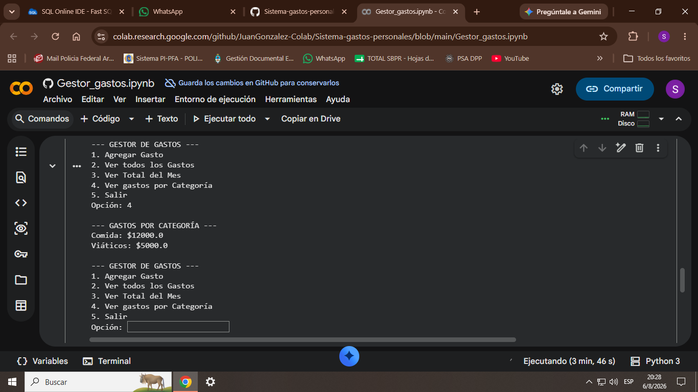

# Sistema de Gastos Personales

Un sistema de consola en Python para registrar y analizar gastos personales usando SQLite.
Permite llevar control de finanzas y ver resúmenes por mes y categoría.

## 🚀 Características

- *Agregar Gastos*: Guarda fecha, categoría, descripción y monto
- *Ver Historial*: Lista todos los gastos ordenados por fecha
- *Resumen Mensual*: Calcula el total gastado en un mes específico
- *Gastos por Categoría*: Agrupa y suma gastos usando GROUP BY de SQL
- *Base de Datos*: Usa SQLite para persistir los datos localmente

## 🛠️ Tecnologías Usadas

- 
- 
- Pandas - Analisis de datos
- Matplotlib - Visualización
- Google Colab _ Ejecución en la nube

## 📦 Cómo Usarlo

1.  Dale al siguiente botón: 
    
2.  ´Ejecutar todo´ y listo
3.  Usa el menú: 1, 2, 3, 4, 5

## Ejemplo de uso
El sistema guarda los datos en un archivo ´gastos.db´ y te permite filtrar por mes:
´2026-08´ > Total gastado: $15300

## Gestor de Gastos v2.0
Aplicación de consola para llevar control de gastos personales.

**Tecnologías**: Python, SQLite, Pandas, Matplotlib

**Features**:
- CRUD completo: Agregar, Ver, Borrar gastos
- Dashboard con gráfico de torta por categoría
- Exportar reporte a Excel

[Ver código](Gestor_gastos_v2.ipynb) | [Descargar ejemplo Excel](reporte_gastos.xlsx)
---

### 📈 Proyecto 3: Análisis de Precios - MercadoLibre
Análisis de datos de Notebooks Gamer usando Pandas y Matplotlib.
Simula extracción vía API y genera insights de precios.

**Tecnologías**: Python, Pandas, Matplotlib, Requests, APIs

**Análisis**:
- [x] Limpieza y carga de datos en DataFrame
- [x] Cálculo de precio promedio y producto más caro
- [x] Gráfico de precio promedio por marca

[Ver código](Analisis_Precios_ML.ipynb) | [Descargar dataset](precios_notebooks_final.csv)

## 👨‍💻 Autor
**Juan Gonzalez**
Proyecto realizado para practicar Python + SQL + Git/GitHub
